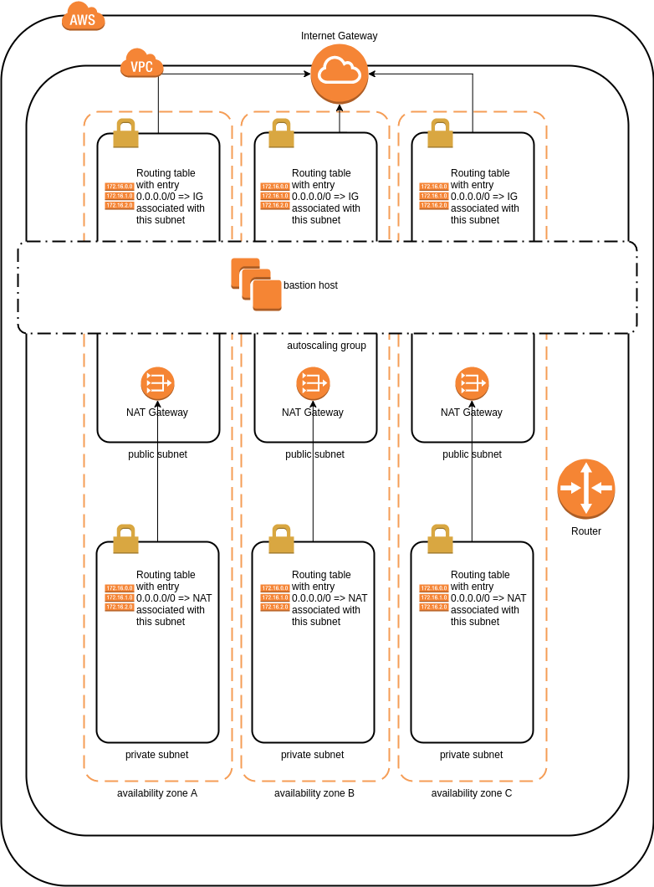

# Summary

Examples of using terraform


# Setup
Create a file called `terraform.tfvars` under the particular example's root directory
```
access_key = "<paste your access key id here>"
secret_key = "<paste your secret key here>"
```
**Warning:**

Examples use AWS to create resources which may incur a charge!


# Particulars
## base

Creates VPC with n private and n public subnets (where n is set to `var.az_count`) and a bastion. 
The map of resources roughly corresponds to 

 
*Note*:

Bastion is in auto-scaling group for availability rather than performance.

'base/docs' directory contains the above draw.io diagram. 
[Here](https://support.draw.io/display/DO/2014/10/06/Using+AWS+2.0+icons+to+create+free+Amazon+architecture+diagrams+in+draw.io) you can find AWS resources for draw.io 
 
## ec2-simple-provisioning

Creates an AWS EC2 instance with wide open security group and demonstrates simple provisioning with not much else than terraform and bash. 

Create with

`
 terraform apply -var 'key_name=<name of SSH key>' -var 'region=<aws region>'
`

Destroy with 

`
 terraform destroy -var 'key_name=<name of SSH key>' -var 'region=<aws region>'
`
